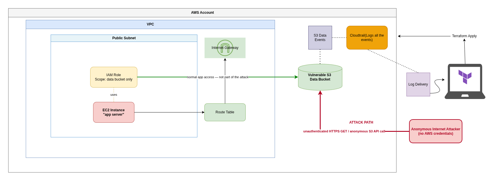
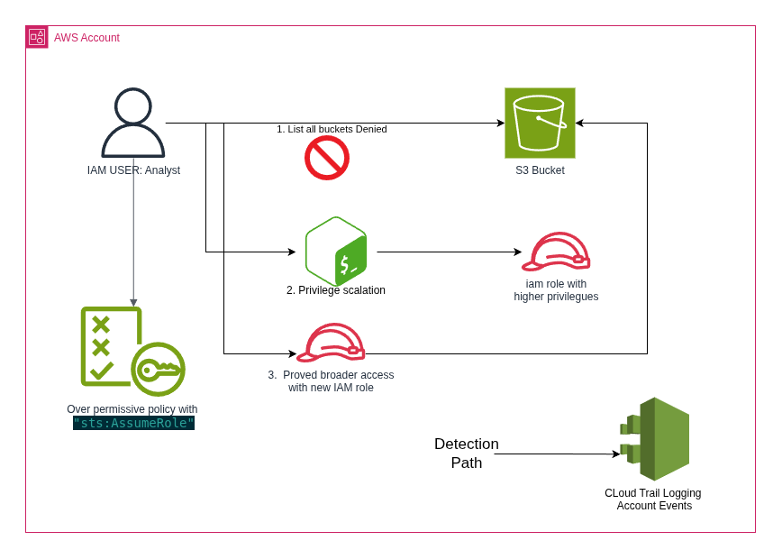
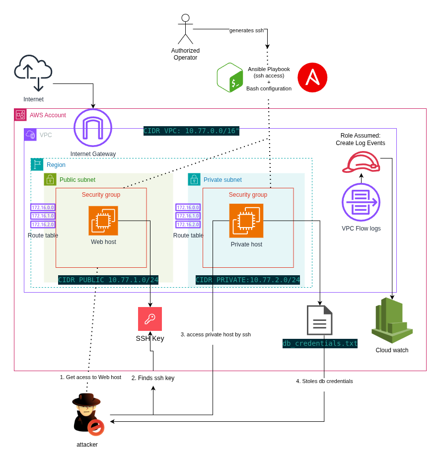

# AWS Attack-Defense Scenario Kit

Self-contained, disposable AWS "scenario packs" for practicing offensive techniques *and* writing the detection logic that catches them. Each pack deploys with Terraform (plus Ansible where host config is needed), gets attacked, gets detected via CloudTrail or VPC Flow Logs, and tears itself down — a full **deploy → attack → detect → remediate → destroy** cycle designed to fit inside one hour.

Built as a hands-on Terraform/AWS security project and a portfolio piece. All three scenarios have been run end-to-end against real AWS infrastructure.

## Why this exists

Most "cloud security" learning is either pure theory (read the whitepaper) or pure CTF (exploit a box someone else configured). This kit closes the loop: **you write the vulnerable infrastructure yourself**, you attack it, and then you write the detection query that would have caught you — so the offense and defense sides reinforce each other. Each scenario isolates exactly **one** misconfiguration, so the detection can target that specific thing instead of "anything weird."

## Scenarios

| # | Scenario | Attack | Detection |
|---|----------|--------|-----------|
| 01 | [S3 Data Exfiltration](scenarios/01-s3-exfil/) | Anonymous public-bucket read (no credentials) | CloudTrail S3 data events |
| 02 | [IAM Privilege Escalation](scenarios/02-iam-privesc/) | `AssumeRole` into a role that trusts the account root | CloudTrail `AssumeRole` event |
| 03 | [EC2 Lateral Movement](scenarios/03-lateral-move/) | Security-group gap: SSH pivot from web tier to data tier | VPC Flow Logs → Logs Insights |

Each scenario directory has its own walkthrough (deploy / attack / detect / remediate / teardown); [`docs/technical-design.md`](docs/technical-design.md) is the deep writeup — vulnerability mechanics, verified findings, and the design tradeoff behind each.

### 01 · S3 Data Exfiltration

A public-subnet app backed by an S3 bucket whose Block Public Access is off *and* whose policy grants `Principal: "*"`. The attack reads the data with **no AWS credentials at all** — it never touches the VPC or EC2 instance, which exist only for realism and the least-privilege contrast.

<p align="center">
  
</p>

### 02 · IAM Privilege Escalation

A low-privilege user with a blanket `sts:AssumeRole` grant escalates into a far more powerful role whose **trust policy trusts the account `:root`** — which really means "any principal in the account." Two independent misconfigurations that are each harmless alone. Purely identity-layer: no VPC or EC2.

<p align="center">
  
</p>

### 03 · EC2 Lateral Movement

Two tiers — a public web host and a private internal host. The only flaw is one security-group rule letting the web tier SSH into the data tier. An attacker who lands on the web host finds a leaked key and pivots to the internal host. Ansible configures the web host; the internal host self-configures at boot, so the *only* web→internal SSH flow is the attack.

<p align="center">
  
</p>

## How the cycle works

| Phase | Time | Tool |
|-------|------|------|
| Deploy | 5–10 min | `terraform apply` (+ Ansible where noted) |
| Attack | 2–5 min | per-scenario `scripts/attack.sh` |
| Detect | 5–15 min | CloudTrail data events / VPC Flow Logs → `scripts/detect.sh` |
| Review + teardown | 5 min | detection query + `terraform destroy` |

**Why not GuardDuty?** Its findings lag 15 min to hours, which doesn't fit the one-hour window. Detection here is built on CloudTrail + VPC Flow Logs (both ~5–15 min) *and* keeps the detection logic explicit and reviewable — you write the query, so you can defend it.

## Getting started

**Prerequisites**

- [Terraform](https://developer.hashicorp.com/terraform) ≥ 1.9 (≥ 1.10 if you use the optional S3 remote state)
- [AWS CLI v2](https://docs.aws.amazon.com/cli/), authenticated (`aws sts get-caller-identity` should return your identity)
- Python 3 + the project venv: `python3 -m venv .venv && .venv/bin/pip install ansible boto3`
- An AWS account you're comfortable deploying *intentionally misconfigured* (but disposable) resources into, with the scoped deploy policy in [`iam/`](iam/) attached (see [`iam/README.md`](iam/README.md)). **Set AWS Budget alerts** before your first `apply`.

**Quick start (Scenario 01)**

```bash
cd scenarios/01-s3-exfil/terraform
terraform init && terraform apply
# attack + detect steps: see scenarios/01-s3-exfil/README.md
terraform destroy          # always tear down when done
```

## Repo layout

```
docs/            architecture diagrams, technical-design.md, remote-state.md, future-work.md
iam/             scoped IAM policy for the Terraform deploy user
scripts/         cross-scenario helpers (e.g. remote-state.sh)
state-backend/   optional one-time bootstrap for S3 remote Terraform state
scenarios/
  01-s3-exfil/     each: terraform/  manifest.yaml  scripts/{attack,detect}.sh  README.md
  02-iam-privesc/
  03-lateral-move/
```

## Safety & cost

- Every resource is tagged (`Project`, `Scenario`, `TTLMinutes`) and buckets are `force_destroy`'d, so `terraform destroy` fully cleans up.
- The misconfigured buckets are **public by design** — only ever decoy data, never left up longer than a run needs.
- A forgotten `t3.micro` is cheap (~$7.50/mo); a forgotten public bucket is the real risk. Budget alerts + always-destroy are the guardrails. A 1-hour auto-teardown is a planned enhancement.

## Optional: remote Terraform state

State is **local** by default (clone and go). To keep it in a versioned, encrypted, private **S3 bucket** with S3-native locking (**no DynamoDB**), there's an opt-in, Terraform-created setup — see [`docs/remote-state.md`](docs/remote-state.md).

## What's next

All three scenarios are complete and verified end-to-end. [`docs/future-work.md`](docs/future-work.md) sketches a larger multi-stage "full-chain compromise" idea deliberately kept out of this kit's scope.

## License

MIT — see [LICENSE](LICENSE).
