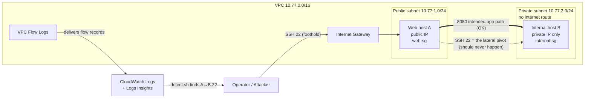

# Scenario 03 — EC2 Lateral Movement

**Status:** ✅ verified end-to-end (deployed, attacked, detected, torn down clean — see [`manifest.yaml`](manifest.yaml) `status`)

## Architecture



The dotted red-intent line (A→B on SSH/22) is the whole vulnerability: the
internal host's security group allows it, when the web tier should only ever
reach B on the app port (8080, the solid line).

## What this deploys

A two-tier VPC: a public **web host** (instance A, internet-reachable on SSH from your IP) and a private **internal host** (instance B, no public IP, think a data/service tier). **Ansible** configures the web host (this is the first scenario to use it); the internal host configures itself at boot via Terraform `user_data` — deliberately, so nothing ever SSHes into B to set it up (see Detect for why that matters). See [`manifest.yaml`](manifest.yaml) for the full spec.

**The vulnerability is a single security-group gap:** B's security group is meant to accept only the application port (8080) from the web tier, but it also allows **SSH (22) from the web tier's SG**. That one extra rule lets an attacker who lands on A open a shell on B — crossing a tier boundary that should never be crossable administratively.

To make the pivot runnable, Ansible stages a **leaked SSH key** on A (a very common real mistake — a reusable private key left on a jump host), and B authorizes that key + stages a decoy `db_credentials.txt` "prize" via its boot `user_data`. The key/decoy are the *means*; the SG gap is the *vulnerability*, and the detection targets the network consequence of it.

## Prerequisite: IAM policy update required

Scenario 3 needs deploy-user permissions the earlier scenarios didn't: EC2 key pairs, VPC Flow Logs, CloudWatch Logs, and passing an IAM role to the Flow Logs service. These are already in [`iam/iac-user-policy.json`](../../iam/iac-user-policy.json) (new `ScenarioFlowLogs` statement; key-pair/flow-log actions added to `NetworkAndCompute`; `PassScenarioRolesToServices` broadened to the Flow Logs service; plus the pending `iam:ListGroupsForUser` fix). **Re-attach the current policy version in the AWS Console** before `terraform apply` — same manual admin step the earlier scenarios needed. See [`iam/README.md`](../../iam/README.md).

## Deploy

```bash
cd terraform
cp terraform.tfvars.example terraform.tfvars   # set allowed_ssh_cidr to YOUR_IP/32
terraform init
terraform plan
terraform apply
```

Defaults assume your SSH public key is `~/.ssh/id_ed25519.pub` — override `public_key_path` in `terraform.tfvars` if not.

## Configure (Ansible)

```bash
scripts/configure.sh
```

Pulls the leaked pivot private key from `terraform output` into the gitignored `ansible/keys/`, builds a one-host inventory, and runs the playbook to plant that key on the web host. It does **not** touch the internal host (B configured itself via `user_data`) — that's the point. Uses the project venv's `ansible-playbook`.

## Attack

```bash
scripts/attack.sh
```

Lands on A, finds the leaked pivot key, and SSHes A→B to read the decoy prize — all routed through A (B is never touched directly from your machine). That A→B SSH is the lateral movement.

## Detect

```bash
scripts/detect.sh
```

Queries VPC Flow Logs in CloudWatch Logs (via **Logs Insights**, not jq-over-S3 — Flow Logs live in CloudWatch Logs) for an ACCEPTED flow from the web host's private IP to the internal host's private IP on port 22. The web tier opening SSH to the data tier is the signature.

**Why this signal is clean:** because B is configured entirely by `user_data` and nothing legitimate ever SSHes into it, *any* `A→B:22` flow is the attack. If instead we had configured B by SSHing through A (a bastion/ProxyJump), that setup traffic would be indistinguishable from the attack — VPC Flow Logs record only IPs/ports/action, not the SSH key or user. That's a real detection-engineering lesson: keep management traffic off the paths you want to alert on.

**Verified (2026-09-08):** the attack produced ACCEPTED `10.77.1.203 → 10.77.2.83 : 22` flows, delivered to CloudWatch Logs ~1-2 min after the attack. A signal-cleanliness check confirmed the web host was the *only* source that ever reached B on port 22 — no configuration or other traffic muddied it.

## Remediate

- Remove the SSH rule from the internal host's SG — the web tier should reach it only on the intended app port.
- Never leave private keys on bastion/jump hosts, and never reuse one key across tiers; prefer agent forwarding or short-lived certificates.
- Segment tiers so a web-tier compromise can't administratively reach the data tier.
- **Manage private hosts with AWS SSM Session Manager, not standing SSH.** The right long-term answer to "how do I administer B without a bastion or an open port 22" is Session Manager: the instance dials *out* to SSM, so there is **no inbound port 22 to leave open by accident**, access is gated by IAM, and every session is logged in CloudTrail. It needs SSM VPC interface endpoints for a private subnet (a small added cost) — a worthwhile enhancement to this scenario, and the pattern a real environment should use instead of the bastion this lab simulates.

## Teardown

```bash
terraform destroy
```

All resources are tagged and named under the `lateral-move-*` prefix. Also delete the local `ansible/keys/` and `ansible/inventory.ini` if you want a fully clean slate (they're gitignored, not committed).
